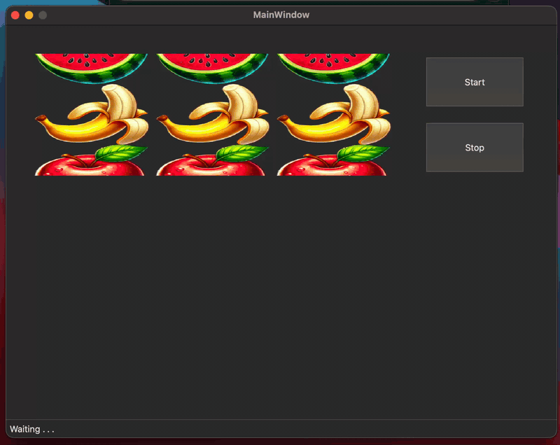

# Casino

Casino — это небольшое простое приложение, в котором можно проверить свою удачу с помощью трёх барабанов с фруктами. Принцип работы построен на трёх состояниях (QState), которые дублируются в statusbar.

## Демонстрация

## Возможности  
- Запуск барабанов
- Остановка барабанов 
- Уведомление о выигрышной комбинации 

## Как это устроено

### Логика на конечном автомате

Состояния приложения описаны через `QStateMachine` (`mainwindow.cpp`, метод `startStateMachine()`).
Автомат состоит из трёх состояний:

- `waiting` — начальное состояние, барабаны остановлены;
- `rolling` — барабаны крутятся;
- `showWin` — выпала выигрышная комбинация.

Переходы: `waiting → rolling` по нажатию кнопки Start; `rolling → waiting` по кнопке Stop
или по сигналу `signalOnWaiting`; `rolling → showWin` по сигналу `signalOnWin`;
`showWin → waiting` после закрытия окна с сообщением о выигрыше.

Когда третий барабан заканчивает вращение (`Reel::spinningFinished`), сравниваются текущие
позиции всех трёх барабанов и отправляется либо `signalOnWin`, либо `signalOnWaiting`.
На входе в каждое состояние в statusbar выводится его название: «Waiting . . .», «Rolling . . .», «WIN».

### Анимация барабанов

Барабан — это виджет `Reel` (`reel.h`, `reel.cpp`) со свойством `Q_PROPERTY(qreal scrollOffset)`.
Свойство анимируется через `QPropertyAnimation` внутри `QParallelAnimationGroup`,
кривая — `QEasingCurve::OutExpo`, поэтому барабан быстро стартует и плавно замедляется в конце.
Три барабана запускаются с разной длительностью (4, 5 и 6 секунд), из-за чего останавливаются
по очереди; конечное значение немного рандомизируется через `QRandomGenerator`.

Отрисовка идёт в `paintEvent()`: по дробной части `scrollOffset` вычисляется сдвиг картинок,
по целой — какая картинка сейчас в окне барабана. После остановки `snapToPosition()` доводит
барабан до целой позиции, чтобы фрукт не оставался обрезанным. Сами картинки подключены
как ресурсы Qt (`casino_resources.qrc`).

## Используемые технологии

Язык программирования: C++

Фреймворк: Qt6 (Widgets, StateMachine, Core, Gui)

Система управления версиями: Git

## Установка и запуск  

1. Установите зависимости:  
   - Qt6   
   - CMake  

2. Склонируйте репозиторий:  
	
 git clone https://github.com/triplq/Casino.git
	
 cd Casino

3. Соберите и запустите проект
	
 mkdir build && cd build
	
 cmake ..
	
 make
